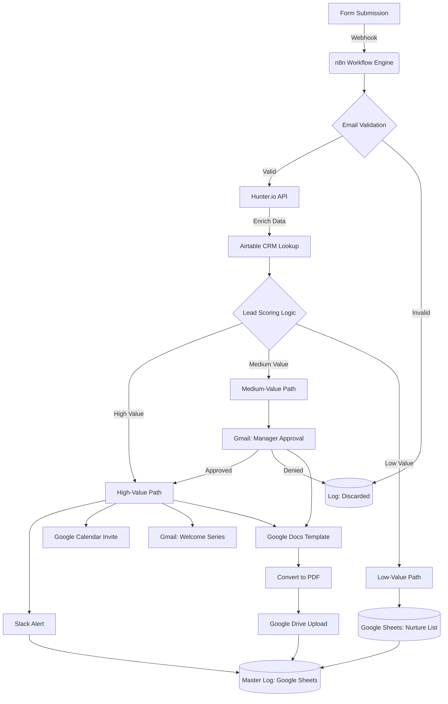

# Lead Qualification & Enrichment Automation

An end-to-end **n8n workflow** designed to automate the lead intake, validation, enrichment, and routing process. This system filters out low-quality leads, calculates lead scores, and triggers personalized engagement via Slack, Gmail, and Google Calendar.

---

## 🚀 Overview

This workflow acts as an automated **Sales Development Representative (SDR)**. It handles everything from initial form submission to booking meetings for high-value leads, ensuring your sales team only focuses on qualified opportunities.

---

## ✨ Features

* **Multi-Stage Validation**: Combines internal logic with **Hunter.io** to verify email deliverability and filter out temporary or fake domains.
* **Deep Lead Enrichment**: Uses the Hunter API to retrieve company details, social profiles, and industry group data.
* **CRM Integration**: Syncs with **Airtable** to check existing customer status (New, General, or VIP) and revenue history.
* **Dynamic Lead Scoring**: A custom logic engine categorizes leads into High, Medium, and Low value based on geography, industry (e.g., Software), and email scores.
* **Automated Document Generation**: Creates a personalized "Lead Brief" in Google Docs, converts it to PDF, and stores it in Google Drive.
* **Sales Orchestration**:
    * **High Value**: Immediate Slack alert to Account Executives and automated Google Calendar scheduling.
    * **Medium Value**: Triggers an approval workflow via Gmail for manual manager review.
    * **Low Value**: Automatically added to a "Nurture List" in Google Sheets.

---

## 🛠️ Tech Stack

* **Automation**: [n8n.io](https://n8n.io/)
* **Intelligence**: Hunter.io (Email Verifier & Information Discovery)
* **CRM/Database**: Airtable, Google Sheets
* **Communication**: Slack, Gmail
* **Productivity**: Google Docs, Google Drive, Google Calendar

---

## 📋 Workflow Logic

1.  **Trigger**: Form submission (Name, Email, Company, Interest Area).
2.  **Validation**: Basic regex and domain checks, followed by Hunter.io's 3rd-party verification.
3.  **Enrichment**: Data retrieval via Hunter Combined API and Airtable lookup.
4.  **Classification**:
    * **Switch Logic**: Segments leads by customer type and revenue.
    * **Scoring**: Incremental scoring based on country (US, UK, IN, DE) and industry group (Software/Marketing).
5.  **Action Paths**:
    * **High-Value**: Slack Notification ➡️ Google Calendar Event ➡️ Welcome Email ➡️ 4-day Wait ➡️ Follow-up Email.
    * **Medium-Value**: Manager Approval Request ➡️ If approved, routes to High-Value path.
    * **Low-Value/Discarded**: Logged in Google Sheets for future marketing nurture.
  

    

    
  
 

## ⚙️ Setup

1.  **Import Workflow**: Download the `Lead_Automation_Workflow.json` and import it into your n8n instance.
2.  **Credentials**: Set up API credentials for:
    * Hunter.io
    * Google Cloud (Gmail, Drive, Docs, Calendar, Sheets)
    * Slack (OAuth)
    * Airtable

3.	**Environment Variables**: Ensure the Folder IDs and Spreadsheet IDs in the node parameters match your local setup.

